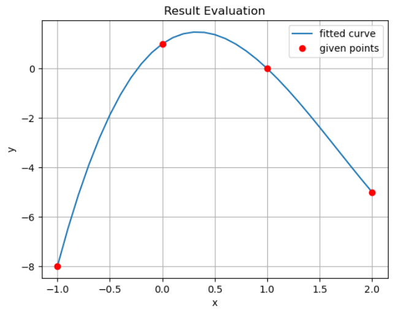

# Artificial-Intelligence-Course-Fall 2023

- [CA1 - Genetic Algorithm (Curve Fitting)](#ca1-genetic-algorithm-curve-fitting)
- [CA2 - Reinforcement Learning (Frozen Lake & Taxi)](#ca2-reinforcement-learning-frozen-lake--taxi)
- [CA3 - Hidden Markov Model (Music Genre Classification)](#ca3-hidden-markov-model-music-genre-classification)
- [CA4 - Machine Learning (Regression & Classification)](#ca4-machine-learning-regression--classification)
- [CA5 - Convolutional Neural Networks (Image Classification)](#ca5-convolutional-neural-networks-image-classification)
- [CA6 - Clustering (Text Clustering)](#ca6-clustering-text-clustering)

## [CA1](https://github.com/MehdiJmlkh/AI/tree/3e74ab508dcfb70de1999a17ade36ef7271bb625/CA1). Genetic Algorithm ([Curve Fitting](https://en.wikipedia.org/wiki/Curve_fitting))

In this project, we are dealing with the problem of curve fitting. In this problem, we need to determine the coefficients of a polynomial expression based on the given points. For example consider the following given points:
$$
a = [0,\space 1] \quad
b = [1, \space 0] \quad
c = [2, \space -5] \quad
d = [-1, \space -8]
$$
These four points lie on the curve of the equation $y = 1 + 3x - 5x^{2} + x^{3}$. 

## [CA2](https://github.com/MehdiJmlkh/AI/tree/3e74ab508dcfb70de1999a17ade36ef7271bb625/CA2). Reinforcement Learning ([Frozen Lake](https://www.gymlibrary.dev/environments/toy_text/frozen_lake/) & [Taxi](https://gymnasium.farama.org/environments/toy_text/taxi/))

In this project, we will discuss Markov Decision Processes (MDP) and Reinforcement Learning (RL) in context of two problems in the [Gym](https://gymnasium.farama.org/) library.
In the first part, we aim to solve the [Frozen Lake](https://www.gymlibrary.dev/environments/toy_text/frozen_lake/) problem using two algorithms: Value Iteration and Policy Iteration algorithms.
Moving on to the second part, we will address RL in the [Taxi](https://gymnasium.farama.org/environments/toy_text/taxi/) problem.
After implementing each part, we will evaluate the algorithms and propose potential improvements.

## [CA3](https://github.com/MehdiJmlkh/AI/tree/3e74ab508dcfb70de1999a17ade36ef7271bb625/CA3). Hidden Markov Model (Music Genre Classification)

In this project, we will explore the application of the Hidden Markov Model (HMM) in the context of music genre classification. Our dataset comprises four music genres. Initially, we will preprocess the dataset and extract its features. In the first section, we will utilize the [hmmlearn](https://hmmlearn.readthedocs.io/en/latest/) library to construct the model. Moving to the second section, we will code the HMM from scratch.

## [CA4](https://github.com/MehdiJmlkh/AI/tree/3e74ab508dcfb70de1999a17ade36ef7271bb625/CA4). Machine Learning (Regression & Classification)

In this project, our goal is to predict the number of customer purchases in a market. The project consists of three phases. In the first phase, we will develop a **linear regression** model from scratch. Then, in the second phase, we will apply the **gradient descent** method. Finally, in the last phase, we will utilize the [**Scikit-Learn**](https://scikit-learn.org/stable/) library to make predictions.

## [CA5](https://github.com/MehdiJmlkh/AI/tree/3e74ab508dcfb70de1999a17ade36ef7271bb625/CA5). Convolutional Neural Networks (Image Classification)

In this computer assignment, we will be applying CNN to classify images. To accomplish this, we will be using the [PyTorch](https://pytorch.org/) framework. Our main focus will be on determining various hyperparameters and different functions within each layer of the network.

## [CA6](https://github.com/MehdiJmlkh/AI/tree/3e74ab508dcfb70de1999a17ade36ef7271bb625/CA6). Clustering (Text Clustering)

In this project, our objective is to explore clustering algorithms by applying them to a text dataset. The dataset comprises news articles sourced from [asriran](https://www.asriran.com/), and our aim is to cluster them.

To accomplish this, we begin by converting the text dataset into a **vector representation**. Subsequently, we utilize the **KMeans** and **DBSCAN** algorithms to cluster the data. Once the clustering is complete, we proceed to visualize the results using PCA (Principal Component Analysis). Finally, we evaluate the quality of the clusters using the Homogeneity and Silhouette scores.

